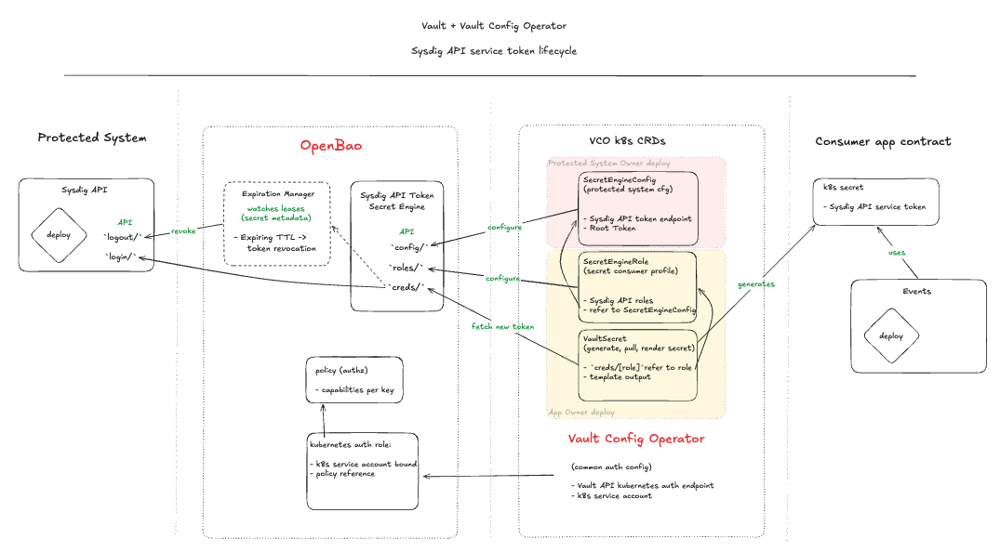
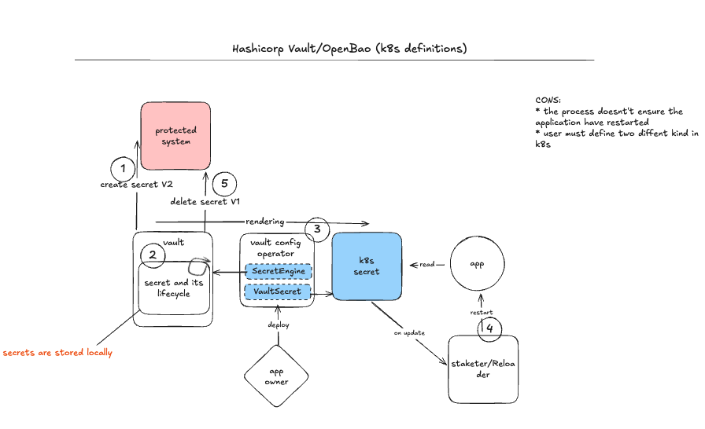
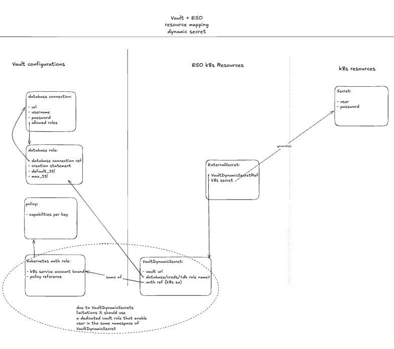

# OpenBao secrets platform: implementation guide

## About this guide

It describes one real implementation, with company and service names generalized. The three diagrams are included as image files beside this document. One screenshot has been lightly edited to replace service-specific labels.

## 1. The problem this solves

Applications need passwords, API tokens, certificates, and other secrets. A secret manager is a service that stores these values, decides who can read or create them, and can expire or revoke them.

**HashiCorp Vault** is a secret manager. **OpenBao** is an open-source, community-driven fork of Vault. It uses a similar API and the same basic ideas: authentication, access policies, secret engines, short-lived tokens, leases, and audit logs.

Before the change described here, more than 230 secrets used by Kubernetes workloads were kept in encrypted files in source control. The files were encrypted, but access to the decryption key could expose many secrets at once, including production values. Auditing and rotation were also harder to manage consistently.

The goal was to move secret creation and access into a central service. Application teams should be able to describe the secret they need without seeing the secret value themselves.

### Important scope detail

The internal project did **not** document a direct migration of data from an existing Vault cluster into OpenBao. The first phase focused on replacing SOPS-encrypted files used by deployment automation. OpenBao was selected after discussions and proof-of-concept work, in part because it keeps a familiar Vault-style API and operating model.

## 2. How the solution works

At a high level:

1. A workload or operator proves its identity to OpenBao.
2. OpenBao checks a policy to decide what that identity is allowed to do.
3. OpenBao reads, creates, or fetches the requested secret.
4. A Kubernetes controller can place the result in a normal Kubernetes Secret.
5. The application reads that Kubernetes Secret as it did before.
6. For dynamic credentials, OpenBao tracks a timer (a **lease**) and can revoke the credential when the lease expires.

A **static secret** stays the same until someone changes it. A **dynamic secret** is created when requested and usually has a limited lifetime. A **policy** is a set of allow/deny rules. A **TTL** is the time before a token or secret expires.

Some Kubernetes resources and APIs still use the word “Vault.” That is often because OpenBao is Vault-compatible or because an existing controller keeps its original name; it does not mean two secret managers must be running.

## 3. The three diagrams

### 3.1 API token: issue, use, and revoke

*This flow shows a protected service issuing a scoped API token through an OpenBao secrets engine. The Kubernetes operator writes the token to a Kubernetes Secret for the application. OpenBao tracks its lease and asks the protected service to revoke the token when it expires or is revoked.*

In this implementation, platform owners configured the protected service, while application owners defined the roles and secret resources they needed. The configuration operator applied those settings to OpenBao. Because the operator did not have generic resources for every custom plugin, the proof of concept reused compatible configuration resources from an existing plugin. That was a workaround, not the ideal long-term interface.

### 3.2 Updating a Kubernetes Secret safely

*The diagram shows a new secret version being created, rendered into a Kubernetes Secret, and then used by the application. A reloader can restart the application when the Secret changes; the old version can be removed after the new one works.*

Two practical limits are called out in the diagram: the secret-sync process does not guarantee that every application restarts, and teams may need to manage more than one Kubernetes resource type. A reloader or an application-specific reload mechanism is still needed when the app only reads a secret at startup.

### 3.3 Dynamic database credentials with External Secrets Operator

*OpenBao stores the database connection and role settings. A Kubernetes service account authenticates to OpenBao, which creates short-lived database credentials. External Secrets Operator then writes the username and password into a Kubernetes Secret for the workload.*

The diagram also records an implementation constraint: the dynamic-secret resource needed a dedicated OpenBao role that allowed the user in the same Kubernetes namespace as the resource.

## 4. Main design choices

| Choice | What it means | Why it was used |
|---|---|---|
| One OpenBao cluster per Kubernetes cluster | Each cluster has its own secret-manager deployment | Limits the impact of a cluster problem and makes isolation easier |
| Raft integrated storage | OpenBao nodes keep replicated storage using Raft | Provides high availability without a separate storage service |
| Five-node reference cluster | The documented reference deployment used five replicas | Supports a Raft quorum and standby nodes; size should still be validated for each environment |
| Cloud KMS auto-unseal | A cloud key-management service helps OpenBao unlock after restart | Avoids manual unsealing during normal operations |
| Kubernetes identity | Workloads authenticate using their Kubernetes service account | Avoids distributing shared passwords to applications |
| Secret Definition resources | Teams describe the secret they need instead of writing the value into a repository | Keeps the value out of normal code review and deployment files |
| Standard Kubernetes Secrets for apps | Controllers write the result into the usual Kubernetes Secret object | Most applications do not need code changes |
| Restricted human access | People authenticate through an identity-aware access path and receive policy-scoped access | Limits who can read or change secrets |
| Snapshots to object storage | OpenBao snapshots are stored outside the cluster | Supports recovery if the cluster or storage is lost |

### A KMS detail that matters during deployment

The cloud KMS seal plugin is included in the OpenBao image. OpenBao checks the plugin's SHA-256 checksum when it starts. The checksum must match the plugin in the image. If the image tag changes but the checksum does not, OpenBao can stay sealed and fail to start normally.

### Bootstrap and root tokens

The initialization job creates the cluster, stores recovery material, enables Kubernetes authentication, and sets up the first operator permissions. Root and recovery material are break-glass credentials: keep access tightly restricted and do not put them in application repositories or ordinary CI/CD variables.

Some bootstrap policies are created only during initialization. Editing the bootstrap script does not automatically update policies in clusters that already exist; those clusters need an explicit, authenticated policy update.

## 5. Deployment steps used in practice

### Step 1: Prepare the Kubernetes environment

Before installing OpenBao, prepare:

* dedicated worker capacity;
* persistent storage;
* TLS certificates and a way to distribute the trusted CA;
* cloud KMS permissions;
* an object-storage location for snapshots;
* image-pull credentials in the required namespaces; and
* monitoring and log collection.

Namespaces were created before the Helm releases because the deployment system could not create them reliably. Helm ownership labels and annotations were added so the releases could manage those namespaces correctly.

The nodes were checked for synchronized time and disabled swap. Swap matters because secret data is handled in memory and must not be written to disk in clear text.

### Step 2: Deploy OpenBao

Deploy the OpenBao chart with TLS, Raft storage, KMS auto-unseal, and the required scheduling rules. Use DNS names that match the TLS certificates; relying on pod IP addresses can cause certificate validation failures.

The reference configuration used a dedicated worker pool and five OpenBao replicas. Confirm the actual replica count, capacity, storage, and quorum requirements for the target environment instead of copying values blindly.

### Step 3: Initialize and check the cluster

Run the initialization process once. Verify that:

* the first node initializes successfully;
* KMS auto-unseal works after a pod restart;
* the other nodes join the Raft cluster;
* one node becomes active and the rest are standby; and
* recovery material is stored only in a restricted location.

### Step 4: Deploy the configuration operator

Deploy the Kubernetes configuration operator after OpenBao and its CA are available. The operator applies OpenBao policies, authentication roles, secret engines, and secret-sync resources.

### Step 5: Apply OpenBao configuration

Apply the policies, Kubernetes authentication, secret-engine configuration, database roles, audit configuration, and snapshot permissions. Give the operator only the permissions it needs.

The snapshot agent was deployed before its permissions and credentials existed. Its first job could therefore report a configuration error until the OpenBao configuration step finished; later runs succeeded. The runbook should make that dependency clear so an expected first-run error is not mistaken for a persistent backup failure.

### Step 6: Move workloads in stages

Start with a pilot workload. Confirm that it can read the secret, that unauthorized workloads are denied, and that application restart or reload works when the secret changes. Then move additional workloads in planned groups.

Remove an old secret source only after its consumers have moved and the new flow has been verified.

## 6. Tests and findings

### Application pilot

The pilot used real application scenarios, not only API calls. It covered a static secret and a generated secret consumed by an application. The goal was to confirm that the controller could write a Kubernetes Secret and that the application could keep using the familiar Kubernetes interface. The pilot task was recorded as completed.

### Token and lease tests

The team tested how the configuration operator's token lifetime interacts with the lifetime of a generated secret. The important finding was that when the token that created a dynamic secret expires, the secret's lease may be revoked too—even if the secret's own TTL looks longer.

Two approaches were tested:

* request a new token with enough lifetime for the longest secret; or
* cache and renew the operator token while making sure active secret leases are not left dependent on a token that is about to expire.

The selected approach cached and renewed the operator token with a sufficiently long TTL. This reduces unexpected revocation, but it also means a token can remain active for a long time if the operator never restarts. The TTL and renewal policy must balance reliability with access risk.

### Security testing

Dynamic security testing was performed against OpenBao 2.5.1. It checked authentication, policy boundaries, privilege escalation, URL handling, and sensitive-data exposure.

The assessment did not confirm an exploitable critical issue under the tested supported configuration. It did identify controls that still matter:

* keep the raw-storage endpoint disabled;
* restrict permissions that can change identity groups or policies;
* limit outbound network access for configured URLs; and
* use unique TOTP secrets where TOTP is used.

A clean assessment does not mean every deployment is safe. The surrounding Kubernetes, network, identity, and policy configuration still matters.

### Audit and backup readiness

OpenBao can stop serving requests if it cannot write to an enabled audit device. The implementation favored a reliable stdout log path first and considered a second file-based audit destination for additional retention. A network audit device was treated carefully because a blocked network write could block requests.

A snapshot job is not proof that recovery works. Restore snapshots in an isolated cluster and confirm that policies, authentication, secrets, and application access recover correctly. The operational guidance calls for restore testing at least twice per year.

## 7. Results and production expectations

The documented work showed that:

* real workloads could consume static and generated secrets through Kubernetes;
* applications could keep using standard Kubernetes Secrets;
* the token/lease test found a production risk before broad rollout and informed the TTL decision;
* security testing found no exploitable critical issue in the tested default configuration;
* the design included per-cluster isolation, Raft, KMS auto-unseal, TLS, and controlled access; and
* audit, backup, upgrade, and recovery work remained part of operating the platform.

OpenBao is not a “set it and forget it” package. The owning SRE/platform team needs to:

* review security advisories and apply updates through vulnerability management;
* plan regular upgrades and verify image digests and plugin checksums;
* monitor audit delivery, authentication failures, latency, seal status, Raft health, storage, and certificate expiry;
* keep access policies and owners up to date;
* test snapshot restoration at least twice a year; and
* keep runbooks for upgrades, recovery, and emergency access current.

Upgrades were not considered zero-downtime. The documented approach takes a snapshot, upgrades standby nodes before the active node, and uses a controlled rollout. A storage-format change may require restoring a snapshot rather than simply deploying the previous image.

### Rollout timing

The review document had a tentative initial target in Q2 2026 and expected broader coverage later in 2026. It did not provide a verified, environment-by-environment production calendar. Confirm the actual rollout status and dates before treating those planning targets as current.

## 8. Short glossary

* **OpenBao:** open-source secrets-management service based on the Vault model.
* **Vault:** HashiCorp's secrets-management product; its API and concepts are also used by OpenBao.
* **Secret engine:** OpenBao component that stores or creates a type of secret.
* **Lease:** OpenBao's record of how long a dynamic secret or token should remain valid.
* **Policy:** Rules that say which identity can read, write, or manage a path.
* **KMS:** Key Management Service; protects the key OpenBao uses to unlock its stored data.
* **Raft:** A way for multiple OpenBao nodes to agree on stored data and elect an active node.
* **CRD:** Kubernetes Custom Resource Definition; adds a new kind of object to the Kubernetes API.
* **Configuration operator:** Kubernetes controller that applies configuration and synchronizes secrets.
* **ESO:** External Secrets Operator; reads from an external secret store and creates Kubernetes Secrets.
* **Auto-unseal:** OpenBao uses KMS to unlock itself after a restart, instead of a person entering key shares each time.

## Sources

This guide is a simplified, organization-neutral summary of internal architecture, deployment, security-review, pilot, token-lifecycle, and audit documentation. The three screenshots in `images/` are included as implementation examples; service-specific names in the token-flow screenshot were generalized.
